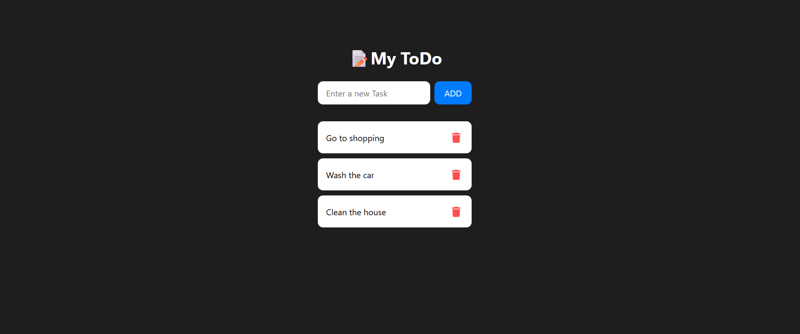

# 📝 React Todo App

A simple and elegant Todo application built with **React**, featuring local storage, smooth animations (using **Framer Motion**), and clean UI.

## 🚀 Features

- ✅ Add and delete tasks
- 📦 Tasks persist using `localStorage`
- 🔁 Smooth animations with **Framer Motion**
- 🧠 Dynamic document title update based on task count
- ✨ Styled with custom CSS

## 📸 Screenshot

 

## 🛠️ Tech Stack

- **React**
- **JavaScript**
- **CSS**
- **Framer Motion**
- **Font Awesome**
